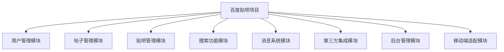
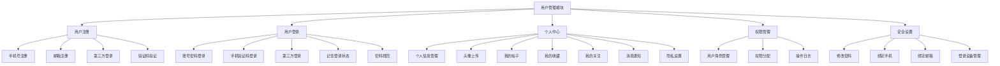
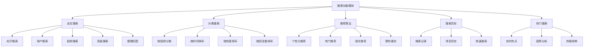
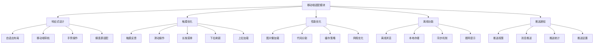

# 百度贴吧毕业设计项目 - 产品脑图

## 1. 项目总体架构



## 2. 用户管理模块



## 3. 帖子管理模块

```mermaid
graph TB
    C[帖子管理模块] --> C1[发布帖子]
    C --> C2[浏览帖子]
    C --> C3[评论回复]
    C --> C4[互动功能]
    C --> C5[帖子管理]
    
    C1 --> C11[选择贴吧]
    C1 --> C12[设置标题]
    C1 --> C13[富文本编辑]
    C1 --> C14[图片上传]
    C1 --> C15[表情功能]
    C1 --> C16[@好友功能]
    C1 --> C17[话题标签]
    
    C2 --> C21[帖子列表]
    C2 --> C22[帖子详情]
    C2 --> C23[楼层显示]
    C2 --> C24[图片预览]
    C2 --> C25[视频播放]
    C2 --> C26[附件下载]
    
    C3 --> C31[发表评论]
    C3 --> C32[回复评论]
    C3 --> C33[楼中楼回复]
    C3 --> C34[评论表情]
    C3 --> C35[评论排序]
    C3 --> C36[评论举报]
    
    C4 --> C41[点赞/踩]
    C4 --> C42[收藏帖子]
    C4 --> C43[分享帖子]
    C4 --> C44[关注作者]
    C4 --> C45[举报功能]
    
    C5 --> C51[编辑帖子]
    C5 --> C52[删除帖子]
    C5 --> C53[置顶管理]
    C5 --> C54[精华管理]
    C5 --> C55[内容审核]
```

## 4. 贴吧管理模块

```mermaid
graph TB
    D[贴吧管理模块] --> D1[创建贴吧]
    D --> D2[贴吧管理]
    D --> D3[成员管理]
    D --> D4[内容管理]
    D --> D5[数据统计]
    
    D1 --> D11[贴吧名称设置]
    D1 --> D12[贴吧分类选择]
    D1 --> D13[贴吧简介]
    D1 --> D14[贴吧头像]
    D1 --> D15[创建规则]
    D1 --> D16[申请审核]
    
    D2 --> D21[基本信息管理]
    D2 --> D22[公告管理]
    D2 --> D23[权限设置]
    D2 --> D24[吧务团队]
    D2 --> D25[吧规设置]
    
    D3 --> D31[成员列表]
    D3 --> D32[成员等级]
    D3 --> D33[禁言管理]
    D3 --> D34[踢出成员]
    D3 --> D35[申请审核]
    
    D4 --> D41[帖子审核]
    D4 --> D42[评论审核]
    D4 --> D43[内容推荐]
    D4 --> D44[违规处理]
    
    D5 --> D51[成员统计]
    D5 --> D52[帖子统计]
    D5 --> D53[活跃度分析]
    D5 --> D54[流量统计]
```



## 5. 搜索功能模块



## 6. 消息系统模块

```mermaid
graph TB
    F[消息系统模块] --> F1[系统通知]
    F --> F2[评论回复]
    F --> F3[@提醒]
    F --> F4[私信功能]
    F --> F5[消息设置]
    
    F1 --> F11[系统公告]
    F1 --> F12[贴吧通知]
    F1 --> F13[活动通知]
    F1 --> F14[审核通知]
    
    F2 --> F21[评论回复通知]
    F2 --> F22[楼中楼回复]
    F2 --> F23[回复内容预览]
    F2 --> F24[快速回复]
    
    F3 --> F31[@用户提醒]
    F3 --> F32[提醒设置]
    F3 --> F33[批量处理]
    
    F4 --> F41[一对一聊天]
    F4 --> F42[群组聊天]
    F4 --> F43[文件传输]
    F4 --> F44[聊天记录]
    F4 --> F45[表情包]
    
    F5 --> F51[消息推送设置]
    F5 --> F52[免打扰模式]
    F5 --> F53[消息过滤]
    F5 --> F54[隐私设置]
```

## 7. 第三方集成模块

```mermaid
graph TB
    G[第三方集成模块] --> G1[身份认证]
    G --> G2[推送服务]
    G --> G3[地图服务]
    G --> G4[社交分享]
    G --> G5[云存储]
    G --> G6[短信服务]
    
    G1 --> G11[微信登录]
    G1 --> G12[QQ登录]
    G1 --> G13[微博登录]
    G1 --> G14[手机号登录]
    G1 --> G15[邮箱登录]
    
    G2 --> G21[极光推送]
    G2 --> G22[个推服务]
    G2 --> G23[消息推送]
    G2 --> G24[推送统计]
    
    G3 --> G31[高德地图]
    G3 --> G32[百度地图]
    G3 --> G33[位置服务]
    G3 --> G34[地理编码]
    
    G4 --> G41[微信分享]
    G4 --> G42[QQ分享]
    G4 --> G43[微博分享]
    G4 --> G44[链接分享]
    G4 --> G45[图片分享]
    
    G5 --> G51[阿里云OSS]
    G5 --> G52[腾讯云COS]
    G5 --> G53[文件上传]
    G5 --> G54[CDN加速]
    
    G6 --> G61[阿里云短信]
    G6 --> G62[腾讯云短信]
    G6 --> G63[验证码发送]
    G6 --> G64[通知短信]
```



## 8. 后台管理模块

```mermaid
graph TB
    H[后台管理模块] --> H1[用户管理]
    H --> H2[内容管理]
    H --> H3[贴吧管理]
    H --> H4[系统设置]
    H --> H5[数据统计]
    H --> H6[安全管理]
    
    H1 --> H11[用户列表]
    H1 --> H12[用户详情]
    H1 --> H13[权限管理]
    H1 --> H14[封禁管理]
    H1 --> H15[操作日志]
    
    H2 --> H21[帖子审核]
    H2 --> H22[评论审核]
    H2 --> H23[内容推荐]
    H2 --> H24[敏感词过滤]
    H2 --> H25[举报处理]
    
    H3 --> H31[贴吧列表]
    H3 --> H32[贴吧详情]
    H3 --> H33[吧务管理]
    H3 --> H34[贴吧分类]
    H3 --> H35[贴吧统计]
    
    H4 --> H41[系统配置]
    H4 --> H42[邮件设置]
    H4 --> H43[短信设置]
    H4 --> H44[第三方配置]
    H4 --> H45[缓存设置]
    
    H5 --> H51[用户统计]
    H5 --> H52[帖子统计]
    H5 --> H53[流量统计]
    H5 --> H54[活跃度分析]
    H5 --> H55[收入统计]
    
    H6 --> H61[安全日志]
    H6 --> H62[IP限制]
    H6 --> H63[访问控制]
    H6 --> H64[数据备份]
    H6 --> H65[系统监控]
```



## 9. 移动端适配模块



## 10. 技术架构脑图

```mermaid
graph TB
    J[技术架构] --> J1[前端技术栈]
    J --> J2[后端技术栈]
    J --> J3[数据库设计]
    J --> J4[第三方服务]
    J --> J5[部署架构]
    
    J1 --> J11[Veaury框架]
    J1 --> J12[Vue 3 + React 18]
    J1 --> J13[TypeScript]
    J1 --> J14[Vite构建]
    J1 --> J15[组件库]
    
    J2 --> J21[Django 4.2]
    J2 --> J22[DRF框架]
    J2 --> J23[Redis缓存]
    J2 --> J24[Celery队列]
    J2 --> J25[Elasticsearch]
    
    J3 --> J31[MySQL 8.0]
    J3 --> J32[数据库设计]
    J3 --> J33[索引优化]
    J3 --> J34[分库分表]
    
    J4 --> J41[身份认证服务]
    J4 --> J42[推送服务]
    J4 --> J43[地图服务]
    J4 --> J44[云存储服务]
    J4 --> J45[短信服务]
    
    J5 --> J51[Docker容器化]
    J5 --> J52[Kubernetes集群]
    J5 --> J53[负载均衡]
    J5 --> J54[监控告警]
    J5 --> J55[CI/CD流水线]
```



## 11. 项目里程碑

### 第一阶段：基础功能 (第1-4周)
- ✅ 项目规划和技术选型
- ✅ 数据库设计和API接口定义
- 🔄 用户认证系统开发
- 🔄 基础贴吧功能实现

### 第二阶段：核心功能 (第5-8周)
- 🔄 帖子发布浏览功能
- 🔄 评论系统开发
- 🔄 搜索功能实现
- 🔄 消息系统开发

### 第三阶段：高级功能 (第9-12周)
- 🔄 第三方服务集成
- 🔄 移动端适配优化
- 🔄 性能优化和安全加固
- 🔄 测试和部署上线

### 第四阶段：运维优化 (第13-16周)
- 🔄 系统监控和告警
- 🔄 数据分析和优化
- 🔄 用户反馈收集
- 🔄 持续迭代改进

## 12. 关键指标 (KPIs)

### 用户指标
- 日活跃用户数 (DAU)
- 月活跃用户数 (MAU)
- 用户留存率
- 用户满意度

### 内容指标
- 每日新增帖子数
- 帖子互动率
- 评论回复率
- 内容质量评分

### 技术指标
- 系统响应时间
- 页面加载速度
- 错误率
- 系统可用性

### 业务指标
- 用户增长率
- 贴吧创建率
- 用户活跃度
- 功能使用率

---

*最后更新: 2024年*  
*项目状态: 进行中*  
*负责人: 李景驰*