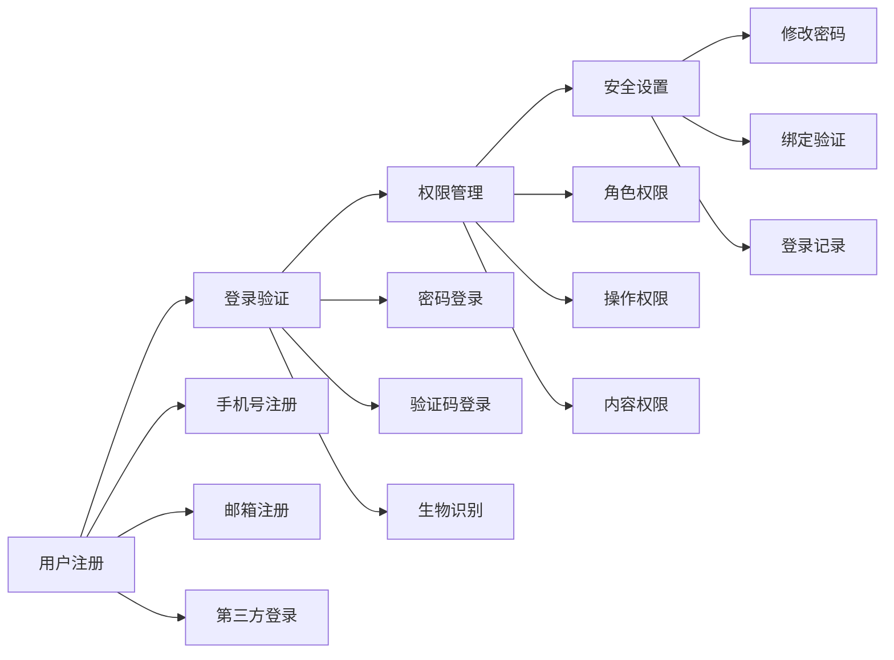
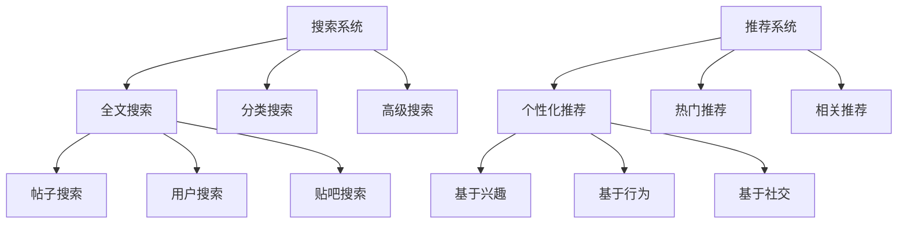
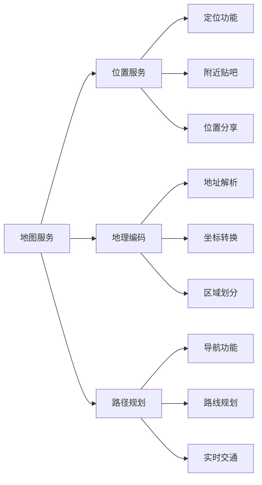
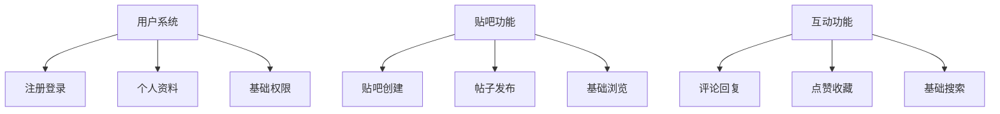

# 百度贴吧毕业设计项目 - 用户群体与功能分析

## 1. 主要用户群体分析

### 1.1 用户群体分类

#### 1.1.1 按年龄层次划分
- **青少年用户 (15-24岁)**
  - 特点：活跃度高，喜欢新鲜事物，社交需求强烈
  - 需求：娱乐交流、兴趣社群、游戏讨论
  - 使用场景：课余时间、周末、假期

- **青年用户 (25-35岁)**
  - 特点：工作稳定，有消费能力，专业性强
  - 需求：专业讨论、职场交流、生活分享
  - 使用场景：通勤时间、工作间隙、晚间

- **中年用户 (36-50岁)**
  - 特点：生活经验丰富，关注实用信息
  - 需求：育儿经验、健康养生、投资理财
  - 使用场景：周末、节假日、晚间

#### 1.1.2 按兴趣领域划分
- **娱乐爱好者**
  - 关注：明星八卦、影视剧、音乐、游戏
  - 活跃度：高
  - 互动需求：强

- **技术爱好者**
  - 关注：编程、数码产品、科技资讯
  - 活跃度：中高
  - 互动需求：专业性强

- **生活爱好者**
  - 关注：美食、旅游、健身、时尚
  - 活跃度：中
  - 互动需求：分享性强

- **学习爱好者**
  - 关注：考试、学习资料、技能提升
  - 活跃度：中高
  - 互动需求：知识交流

### 1.2 用户画像 (Personas)

#### 1.2.1 学生用户 - 小明
- **基本信息**：18岁，高中生
- **使用场景**：课余时间、周末
- **核心需求**：
  - 与同学交流学习心得
  - 参与游戏讨论社区
  - 关注偶像明星动态
- **功能偏好**：
  - 简单易用的界面
  - 快速发帖和回复
  - 表情包和趣味功能

#### 1.2.2 职场新人 - 小李
- **基本信息**：25岁，程序员
- **使用场景**：通勤时间、工作间隙
- **核心需求**：
  - 技术问题讨论
  - 职场经验交流
  - 行业资讯获取
- **功能偏好**：
  - 专业的技术讨论区
  - 高质量的搜索功能
  - 私密的消息系统

#### 1.2.3 家庭主妇 - 王阿姨
- **基本信息**：40岁，家庭主妇
- **使用场景**：家务间隙、晚间
- **核心需求**：
  - 育儿经验分享
  - 健康养生信息
  - 生活小技巧交流
- **功能偏好**：
  - 简单直观的操作
  - 图片分享功能
  - 实用的生活资讯

## 2. App核心功能实现

### 2.1 基础功能模块

#### 2.1.1 用户认证系统


#### 2.1.2 贴吧管理功能
- **贴吧创建**
  - 名称审核机制
  - 分类标签系统
  - 创建权限控制
  
- **贴吧运营**
  - 吧务团队管理
  - 内容审核流程
  - 用户行为管理
  
- **贴吧互动**
  - 成员等级系统
  - 签到功能
  - 活跃度统计

### 2.2 核心交互功能

#### 2.2.1 帖子发布与浏览
```javascript
// 帖子发布流程
const postPublishFlow = {
    step1: '选择贴吧',
    step2: '输入标题',
    step3: '编辑内容',
    step4: '添加附件',
    step5: '设置权限',
    step6: '发布审核'
};

// 帖子浏览体验
const postViewingExperience = {
    loading: '快速加载',
    layout: '响应式设计',
    interaction: '流畅操作',
    content: '丰富媒体'
};
```

#### 2.2.2 评论互动系统
- **评论功能**
  - 多级评论结构
  - 楼中楼回复
  - 表情包支持
  
- **互动功能**
  - 点赞/踩系统
  - 收藏功能
  - 分享功能
  
- **通知系统**
  - 实时消息推送
  - @提醒功能
  - 私信系统

### 2.3 高级功能模块

#### 2.3.1 搜索与推荐


#### 2.3.2 消息系统
- **系统通知**
  - 审核结果通知
  - 系统公告
  - 活动提醒
  
- **用户互动**
  - 评论回复通知
  - @提醒通知
  - 私信聊天
  
- **推送管理**
  - 推送设置
  - 免打扰模式
  - 消息分类

## 3. 第三方功能集成

### 3.1 身份认证集成

#### 3.1.1 社交登录
```yaml
第三方登录配置:
  微信登录:
    - 授权流程
    - 用户信息获取
    - 安全验证
    
  QQ登录:
    - OAuth2.0协议
    - 用户绑定
    - 登录状态同步
    
  微博登录:
    - 社会化分享
    - 内容同步
    - 粉丝关系
```

#### 3.1.2 手机验证
- **短信验证码**
  - 阿里云短信服务
  - 腾讯云短信服务
  - 验证码频率控制
  
- **语音验证码**
  - 备用验证方式
  - 无障碍访问支持
  - 国际化支持

### 3.2 推送服务集成

#### 3.2.1 消息推送
```javascript
const pushServiceConfig = {
    provider: '极光推送',
    features: {
        realTime: '实时消息推送',
        scheduled: '定时推送',
        targeted: '精准推送',
        analytics: '推送统计'
    },
    integration: {
        android: 'FCM/厂商通道',
        ios: 'APNs推送',
        web: 'Web Push API'
    }
};
```

#### 3.2.2 推送策略
- **用户分组推送**
  - 按兴趣标签
  - 按活跃程度
  - 按地理位置
  
- **智能推送时机**
  - 用户活跃时间段
  - 内容热度判断
  - 个性化推荐

### 3.3 地图服务集成

#### 3.3.1 地理位置功能


#### 3.3.2 基于位置的服务
- **附近贴吧**
  - 地理位置匹配
  - 距离排序
  - 热门推荐
  
- **位置签到**
  - 打卡功能
  - 签到记录
  - 位置分享
  
- **地理围栏**
  - 区域提醒
  - 活动推送
  - 本地化内容

### 3.4 社交分享集成

#### 3.4.1 分享功能
```yaml
分享平台支持:
  微信生态:
    - 微信好友分享
    - 朋友圈分享
    - 小程序分享
    
  QQ生态:
    - QQ好友分享
    - QQ空间分享
    - QQ群分享
    
  微博平台:
    - 微博分享
    - 话题参与
    - @好友功能
    
  其他平台:
    - 钉钉分享
    - 企业微信
    - 复制链接
```

#### 3.4.2 分享内容优化
- **内容格式化**
  - 标题优化
  - 摘要生成
  - 图片处理
  
- **分享统计**
  - 分享次数统计
  - 分享渠道分析
  - 转化率跟踪
  
- **深度链接**
  - App内跳转
  - 场景还原
  - 用户引导

## 4. 功能优先级规划

### 4.1 MVP (最小可行产品) 功能

#### 4.1.1 第一阶段：核心功能


#### 4.1.2 第二阶段：增强功能
- **消息系统**：评论通知、系统消息
- **搜索优化**：全文搜索、分类搜索
- **内容管理**：审核机制、举报功能

### 4.2 扩展功能规划

#### 4.2.1 高级功能
- **实时聊天**：WebSocket实时通信
- **视频功能**：视频上传、在线播放
- **数据分析**：用户行为分析、内容推荐

#### 4.2.2 商业化功能
- **广告系统**：精准广告投放
- **会员服务**：VIP特权功能
- **电商功能**：贴吧商城、虚拟商品

## 5. 技术实现考量

### 5.1 性能优化策略

#### 5.1.1 前端性能
```javascript
// 性能优化配置
const performanceConfig = {
    codeSplitting: '代码分割',
    lazyLoading: '懒加载',
    caching: '缓存策略',
    compression: '资源压缩'
};
```

#### 5.1.2 后端性能
- **数据库优化**：索引优化、查询优化
- **缓存策略**：Redis缓存、CDN加速
- **负载均衡**：水平扩展、服务拆分

### 5.2 安全防护措施

#### 5.2.1 数据安全
- **加密传输**：HTTPS协议、数据加密
- **权限控制**：RBAC权限模型
- **数据备份**：定期备份、灾难恢复

#### 5.2.2 内容安全
- **内容审核**：机器审核、人工审核
- **敏感词过滤**：实时过滤、智能识别
- **举报机制**：用户举报、快速处理

## 6. 用户体验设计

### 6.1 界面设计原则

#### 6.1.1 设计规范
```yaml
设计系统:
  色彩体系:
    - 主色调: #007AFF (蓝色)
    - 辅助色: #34C759 (绿色)
    - 警告色: #FF9500 (橙色)
    - 错误色: #FF3B30 (红色)
    
  字体系统:
    - 主字体: -apple-system, BlinkMacSystemFont
    - 字号规范: 12px-48px
    - 字重规范: 300-700
    
  间距系统:
    - 基础间距: 8px
    - 组件间距: 16px
    - 页面间距: 24px
```

#### 6.1.2 交互设计
- **手势操作**：滑动、长按、双击
- **动画效果**：过渡动画、微交互
- **反馈机制**：加载状态、操作反馈

### 6.2 无障碍设计

#### 6.2.1 可访问性支持
- **屏幕阅读器**：ARIA标签、语义化HTML
- **键盘导航**：Tab键导航、快捷键
- **颜色对比**：WCAG 2.1标准

#### 6.2.2 国际化支持
- **多语言**：中英文支持、RTL布局
- **本地化**：日期格式、货币单位
- **文化适配**：图标含义、颜色含义

---

*文档版本: v1.0*  
*最后更新: 2024年*  
*下一步计划: 界面原型设计*