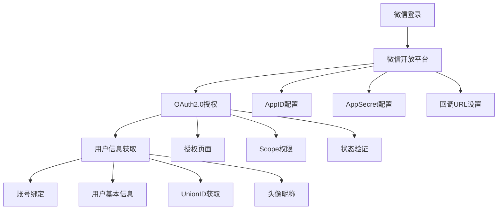
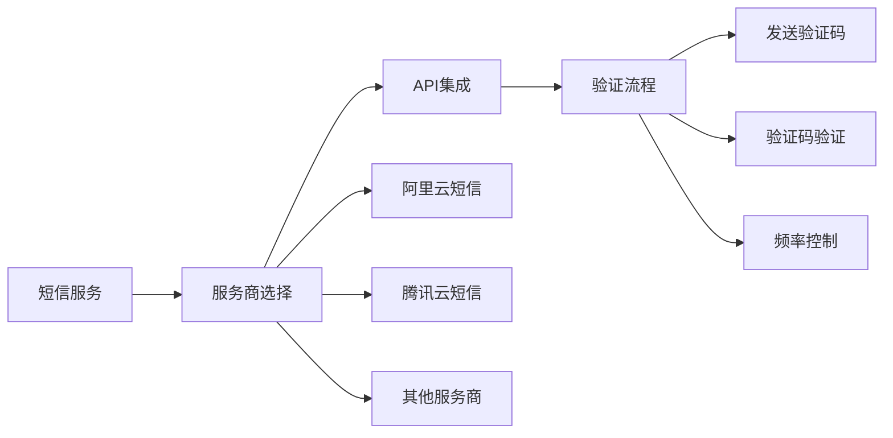
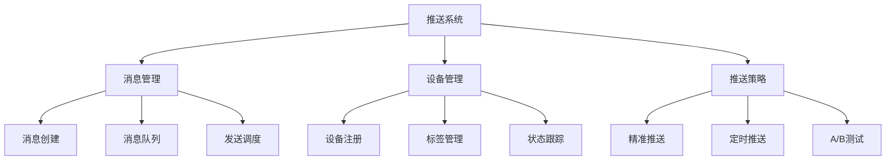
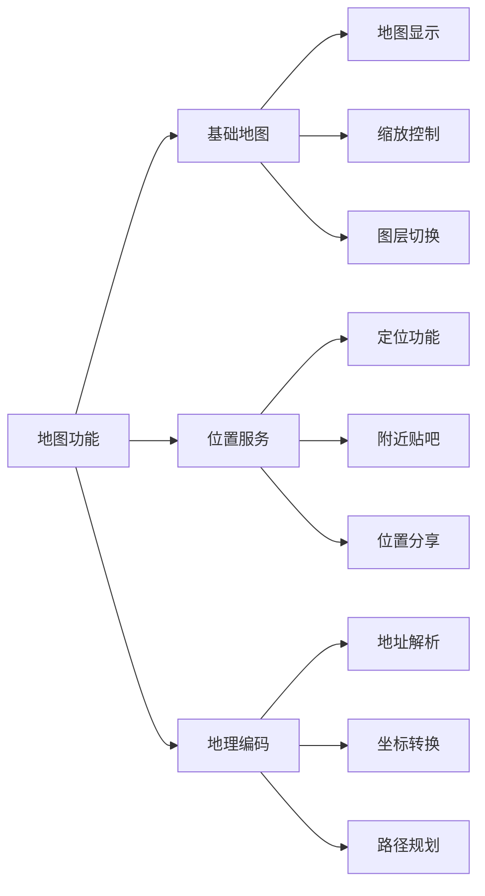
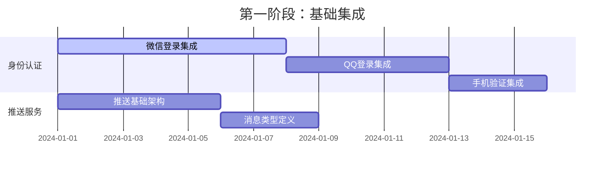

# 百度贴吧毕业设计项目 - 第三方功能集成方案

## 1. 第三方功能集成概述

### 1.1 集成目标
基于Pixso设计理念，实现现代化、用户友好的第三方功能集成，提升用户体验和产品价值。

### 1.2 集成原则
- **用户体验优先**：无缝集成，不影响核心功能
- **安全性保障**：数据加密，权限控制
- **性能优化**：异步加载，按需使用
- **可扩展性**：模块化设计，易于维护

## 2. 身份认证集成方案

### 2.1 第三方登录集成

#### 2.1.1 微信登录集成


**技术实现细节：**
```javascript
// 微信登录配置
const wechatConfig = {
    appId: 'wx_your_app_id',
    scope: 'snsapi_userinfo',
    redirectUri: 'https://your-domain.com/auth/wechat/callback',
    state: 'random_security_string'
};

// 登录流程
async function wechatLogin() {
    // 1. 跳转微信授权页面
    const authUrl = `https://open.weixin.qq.com/connect/oauth2/authorize?appid=${wechatConfig.appId}&redirect_uri=${encodeURIComponent(wechatConfig.redirectUri)}&response_type=code&scope=${wechatConfig.scope}&state=${wechatConfig.state}#wechat_redirect`;
    
    // 2. 获取授权码
    // 3. 使用授权码获取access_token
    // 4. 获取用户信息
    // 5. 创建或绑定账号
}
```

#### 2.1.2 QQ登录集成
**技术架构：**
```yaml
QQ登录配置:
  应用信息:
    - AppID: "your_qq_app_id"
    - AppKey: "your_qq_app_key"
    - 回调地址: "https://your-domain.com/auth/qq/callback"
    
  授权流程:
    - 步骤1: 用户点击QQ登录
    - 步骤2: 跳转QQ授权页面
    - 步骤3: 用户授权
    - 步骤4: 返回授权码
    - 步骤5: 获取Access Token
    - 步骤6: 获取OpenID和用户信息
    - 步骤7: 账号绑定/创建
```

#### 2.1.3 微博登录集成
**功能特性：**
- 社会化分享集成
- 内容同步功能
- 粉丝关系导入
- 话题参与支持

### 2.2 手机验证集成

#### 2.2.1 短信验证服务


**技术实现：**
```javascript
// 短信服务配置
const smsConfig = {
    provider: 'aliyun', // 阿里云短信
    accessKeyId: 'your_access_key',
    accessKeySecret: 'your_secret_key',
    signName: '贴吧社区',
    templateCode: 'SMS_123456789'
};

// 发送验证码
async function sendSMSCode(phoneNumber) {
    const code = generateRandomCode(6); // 生成6位随机码
    
    // 调用短信服务API
    const result = await smsService.send({
        PhoneNumbers: phoneNumber,
        SignName: smsConfig.signName,
        TemplateCode: smsConfig.templateCode,
        TemplateParam: `{"code":"${code}"}`
    });
    
    // 存储验证码到Redis，设置5分钟过期
    await redis.setex(`sms:${phoneNumber}`, 300, code);
    
    return result;
}
```

#### 2.2.2 语音验证码
**应用场景：**
- 网络环境不佳时
- 无障碍访问支持
- 国际用户支持
- 备用验证方式

## 3. 推送服务集成方案

### 3.1 极光推送集成

#### 3.1.1 推送服务架构


#### 3.1.2 推送类型设计
```javascript
// 推送消息类型定义
const pushMessageTypes = {
    COMMENT_REPLY: {
        title: '有人回复了你的评论',
        content: '${username}回复了你的评论：${preview}',
        action: 'OPEN_COMMENT',
        priority: 'HIGH'
    },
    
    POST_LIKE: {
        title: '有人赞了你的帖子',
        content: '${username}赞了你的帖子',
        action: 'OPEN_POST',
        priority: 'NORMAL'
    },
    
    SYSTEM_NOTICE: {
        title: '系统通知',
        content: '${content}',
        action: 'OPEN_NOTICE',
        priority: 'HIGH'
    },
    
    ACTIVITY_REMINDER: {
        title: '活动提醒',
        content: '${activityName}即将开始',
        action: 'OPEN_ACTIVITY',
        priority: 'NORMAL'
    }
};
```

### 3.2 推送策略优化

#### 3.2.1 智能推送时机
```yaml
推送时机策略:
  用户活跃时段:
    - 工作日: 08:00-09:00, 12:00-13:00, 18:00-22:00
    - 周末: 09:00-12:00, 14:00-18:00, 20:00-23:00
    
  内容热度判断:
    - 高热度内容: 实时推送
    - 中热度内容: 延迟推送
    - 低热度内容: 批量推送
    
  个性化推荐:
    - 基于用户兴趣标签
    - 基于历史行为分析
    - 基于社交关系网络
```

#### 3.2.2 推送频率控制
- **用户级别控制**：每个用户每日推送上限
- **内容级别控制**：不同类型内容推送频率
- **时间级别控制**：避免夜间打扰
- **地域级别控制**：考虑时区差异

## 4. 地图服务集成方案

### 4.1 高德地图集成

#### 4.1.1 地图功能设计


#### 4.1.2 基于位置的服务
```javascript
// 附近贴吧功能实现
class NearbyTiebaService {
    constructor() {
        this.map = new AMap.Map('map-container');
        this.geolocation = new AMap.Geolocation();
    }
    
    // 获取用户位置
    async getUserLocation() {
        return new Promise((resolve, reject) => {
            this.geolocation.getCurrentPosition((status, result) => {
                if (status === 'complete') {
                    resolve(result);
                } else {
                    reject(new Error('获取位置失败'));
                }
            });
        });
    }
    
    // 搜索附近贴吧
    async searchNearbyTieba(location, radius = 5000) {
        const params = {
            location: `${location.lng},${location.lat}`,
            radius: radius,
            types: '社区|论坛',
            keywords: '贴吧'
        };
        
        return await this.searchAround(params);
    }
    
    // 在地图上显示贴吧标记
    displayTiebaMarkers(tiebaList) {
        tiebaList.forEach(tieba => {
            const marker = new AMap.Marker({
                position: [tieba.location.lng, tieba.location.lat],
                title: tieba.name,
                content: this.createMarkerContent(tieba)
            });
            
            marker.on('click', () => {
                this.showTiebaDetail(tieba);
            });
            
            this.map.add(marker);
        });
    }
}
```

### 4.2 位置签到功能

#### 4.2.1 签到系统设计
```yaml
签到功能配置:
  签到类型:
    - 普通签到: 基础积分奖励
    - 连续签到: 递增积分奖励
    - 特殊地点签到: 额外奖励
    - 活动签到: 活动参与资格
    
  签到规则:
    - 每日签到次数限制
    - 签到地点范围限制
    - 签到时间间隔限制
    - 防作弊验证机制
```

#### 4.2.2 地理围栏应用
- **贴吧范围围栏**：自动加入附近贴吧
- **活动区域围栏**：活动参与提醒
- **商家合作围栏**：优惠信息推送
- **安全区域围栏**：危险区域提醒

## 5. 社交分享集成方案

### 5.1 多平台分享集成

#### 5.1.1 分享平台支持
```mermaid
graph TB
    S[分享平台] --> S1[微信生态]
    S --> S2[QQ生态]
    S --> S3[微博平台]
    S --> S4[其他平台]
    
    S1 --> S11[微信好友]
    S1 --> S12[朋友圈]
    S1 --> S13[小程序]
    
    S2 --> S21[QQ好友]
    S2 --> S22[QQ空间]
    S2 --> S23[QQ群]
    
    S3 --> S31[微博分享]
    S3 --> S32[话题参与]
    S3 --> S33[@好友功能]
    
    S4 --> S41[钉钉分享]
    S4 --> S42[企业微信]
    S4 --> S43[复制链接]
```

#### 5.1.2 分享内容优化
```javascript
// 分享内容生成器
class ShareContentGenerator {
    generatePostShare(post) {
        return {
            title: this.truncateTitle(post.title, 30),
            description: this.generateDescription(post.content),
            image: this.getFirstImage(post.images) || this.defaultImage,
            url: this.generateShareUrl(post.id),
            quote: this.extractQuote(post.content)
        };
    }
    
    generateTiebaShare(tieba) {
        return {
            title: `【${tieba.name}】贴吧`,
            description: tieba.description || `欢迎加入${tieba.name}贴吧`,
            image: tieba.avatar || this.defaultTiebaImage,
            url: this.generateTiebaUrl(tieba.id),
            quote: `发现一个有趣的贴吧：${tieba.name}`
        };
    }
    
    // 平台特定的分享配置
    getPlatformConfig(platform) {
        const configs = {
            wechat: {
                appId: 'wx_share_app_id',
                timestamp: Date.now(),
                nonceStr: this.generateNonce(),
                signature: this.generateSignature()
            },
            qq: {
                appId: 'qq_share_app_id',
                imageUrl: this.resizeImage(this.shareImage, 200, 200)
            },
            weibo: {
                appKey: 'weibo_app_key',
                content: this.generateWeiboContent()
            }
        };
        
        return configs[platform] || {};
    }
}
```

### 5.2 分享统计与分析

#### 5.2.1 分享数据追踪
```javascript
// 分享事件追踪
class ShareAnalytics {
    trackShareEvent(shareData) {
        const event = {
            type: 'share',
            platform: shareData.platform,
            contentType: shareData.contentType,
            contentId: shareData.contentId,
            timestamp: Date.now(),
            userId: this.getUserId(),
            deviceInfo: this.getDeviceInfo()
        };
        
        // 发送到数据分析平台
        this.sendToAnalytics(event);
        
        // 本地存储
        this.storeLocally(event);
    }
    
    // 分享转化率分析
    analyzeConversion() {
        return {
            totalShares: this.getTotalShares(),
            uniqueShares: this.getUniqueShares(),
            conversions: this.getConversions(),
            conversionRate: this.calculateConversionRate()
        };
    }
}
```

#### 5.2.2 深度链接优化
- **App内跳转**：直接打开对应内容
- **场景还原**：保持用户操作上下文
- **用户引导**：新用户注册引导
- **个性化推荐**：基于分享来源的推荐

## 6. 技术实现架构

### 6.1 前端集成架构

#### 6.1.1 组件化设计
```javascript
// 第三方服务组件库
const ThirdPartyComponents = {
    // 登录组件
    LoginButtons: {
        WechatLogin: '第三方登录/微信登录按钮',
        QQLogin: '第三方登录/QQ登录按钮',
        WeiboLogin: '第三方登录/微博登录按钮'
    },
    
    // 分享组件
    SharePanel: {
        WechatShare: '分享组件/微信分享',
        QQShare: '分享组件/QQ分享',
        WeiboShare: '分享组件/微博分享'
    },
    
    // 地图组件
    MapComponents: {
        LocationPicker: '地图组件/位置选择器',
        NearbyTieba: '地图组件/附近贴吧',
        CheckInMap: '地图组件/签到地图'
    }
};
```

#### 6.1.2 状态管理设计
```javascript
// 第三方服务状态管理
class ThirdPartyStore {
    constructor() {
        this.state = {
            // 登录状态
            login: {
                wechat: { connected: false, userInfo: null },
                qq: { connected: false, userInfo: null },
                weibo: { connected: false, userInfo: null }
            },
            
            // 推送设置
            push: {
                enabled: true,
                settings: {
                    comments: true,
                    likes: true,
                    system: true,
                    activities: false
                }
            },
            
            // 位置服务
            location: {
                enabled: false,
                currentLocation: null,
                nearbyTieba: []
            },
            
            // 分享历史
            shareHistory: []
        };
    }
    
    // 更新登录状态
    updateLoginStatus(platform, status) {
        this.state.login[platform] = { ...this.state.login[platform], ...status };
    }
    
    // 获取推送设置
    getPushSettings() {
        return this.state.push.settings;
    }
}
```

### 6.2 后端集成架构

#### 6.2.1 服务层设计
```python
# 第三方服务管理器
class ThirdPartyServiceManager:
    def __init__(self):
        self.wechat_service = WechatService()
        self.qq_service = QQService()
        self.weibo_service = WeiboService()
        self.push_service = PushService()
        self.map_service = MapService()
    
    # 统一登录接口
    async def third_party_login(self, platform: str, auth_code: str) -> Dict:
        service = getattr(self, f"{platform}_service")
        user_info = await service.authenticate(auth_code)
        
        # 创建或更新用户
        user = await self.get_or_create_user(platform, user_info)
        
        return {
            'user': user,
            'token': self.generate_token(user),
            'third_party_info': user_info
        }
    
    # 推送服务
    async def send_push_notification(self, user_ids: List[int], message: Dict) -> bool:
        devices = await self.get_user_devices(user_ids)
        return await self.push_service.send(devices, message)
```

#### 6.2.2 配置管理
```yaml
# 第三方服务配置
third_party_config:
  wechat:
    app_id: "${WECHAT_APP_ID}"
    app_secret: "${WECHAT_APP_SECRET}"
    redirect_uri: "${BASE_URL}/auth/wechat/callback"
    
  qq:
    app_id: "${QQ_APP_ID}"
    app_key: "${QQ_APP_KEY}"
    redirect_uri: "${BASE_URL}/auth/qq/callback"
    
  push:
    jpush:
      app_key: "${JPUSH_APP_KEY}"
      master_secret: "${JPUSH_MASTER_SECRET}"
    
  map:
    amap:
      key: "${AMAP_API_KEY}"
      security_code: "${AMAP_SECURITY_CODE}"
```

## 7. 安全与隐私保护

### 7.1 数据安全措施

#### 7.1.1 数据传输安全
- **HTTPS加密**：所有API请求使用HTTPS
- **数据加密**：敏感数据加密存储
- **令牌安全**：JWT令牌短期有效
- **防重放攻击**：请求时间戳验证

#### 7.1.2 用户隐私保护
- **数据最小化**：只收集必要信息
- **用户授权**：明确的功能授权
- **数据删除**：支持用户数据删除
- **隐私政策**：清晰的隐私政策说明

### 7.2 合规性要求

#### 7.2.1 法律法规遵守
- **个人信息保护法**：用户信息保护
- **网络安全法**：数据安全要求
- **平台政策**：各平台开发规范
- **国际标准**：GDPR等国际标准

#### 7.2.2 审核机制
- **内容审核**：用户生成内容审核
- **行为监控**：异常行为检测
- **投诉处理**：用户投诉响应机制
- **安全审计**：定期安全评估

## 8. 实施计划与时间表

### 8.1 分阶段实施计划

#### 8.1.1 第一阶段：基础集成（2周）


#### 8.1.2 第二阶段：功能完善（3周）
- **地图服务集成**：位置功能、附近贴吧
- **分享功能完善**：多平台分享、数据统计
- **推送策略优化**：智能推送、频率控制

#### 8.1.3 第三阶段：优化测试（2周）
- **性能优化**：加载优化、缓存策略
- **安全测试**：渗透测试、漏洞修复
- **用户体验测试**：A/B测试、用户反馈

### 8.2 质量保证措施

#### 8.2.1 测试策略
- **单元测试**：每个服务模块测试
- **集成测试**：第三方API集成测试
- **性能测试**：高并发场景测试
- **兼容性测试**：多平台兼容测试

#### 8.2.2 监控告警
- **服务监控**：API可用性监控
- **性能监控**：响应时间监控
- **错误监控**：异常错误收集
- **业务监控**：关键指标监控

---

*文档版本: v1.0*  
*最后更新: 2024年*  
*下一步计划: 界面原型设计*